TACC Analysis Portal
====================

The `TACC Analysis Portal (TAP) <https://tap.tacc.utexas.edu/>`_ provides web-based access to 
interactive computing environments on TACC systems, including Jupyter Notebooks, remote desktops, 
and RStudio.  Any user with an allocation on one of TACC's HPC systems can log in to TAP and use the 
services. 

Over the course of this workshop, we will be using TAP to launch Jupyter Notebooks and DCV 
remote desktop sessions for interactively writing and running Python code and training machine learning models. 

By the end of this section, you should be able to:

* Log in to the TACC Analysis Portal
* Submit a Jupyter Notebook job to a TACC system
* Connect to a Jupyter Notebook session
* Choose the correct Jupyter kernel
* Run simple Python code in a Jupyter Notebook

Launching a Jupyter Notebook
--------------------

To start a notebook session:

1. Log in to the `TACC Analysis Portal (TAP) <https://tap.tacc.utexas.edu/>`_ using your TACC credentials and MFA token. 

Once logged in, you'll be directed to the Home Screen where you can submit a job using the interface shown below: 

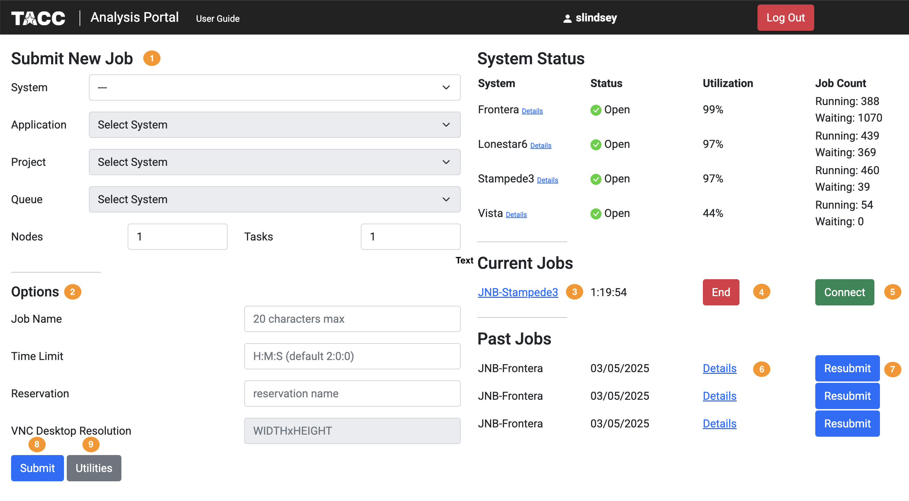

.. raw:: html

   2. Select the following required inputs:
   <b>&nbsp;( 1 )&nbsp;</b>
     

* **System:** Vista

* **Application:** Jupyter Notebook

* **Project:** your assigned workshop allocation

* **Queue:** gg

* **Nodes:** 1 
  
* **Tasks:** 1 
  
.. raw:: html

   3. Fill out additional job details:
   <b>&nbsp;( 2 )&nbsp;</b>
     

* **Job Name**: A descriptive name for your notebook session (e.g., LS-ML-Day1)

* **Time Limit:** 3:0:0
  
* **Reservation:** distributed by TACC staff
  

.. raw:: html

   4. Click the <b>Submit</b>
   <b>&nbsp;( 8 )&nbsp;</b>
   button
     

.. raw:: html

    This will submit your job
   to the remote system. After submitting the job, you will be automatically redirected
   to the job status page (shown below). 
     

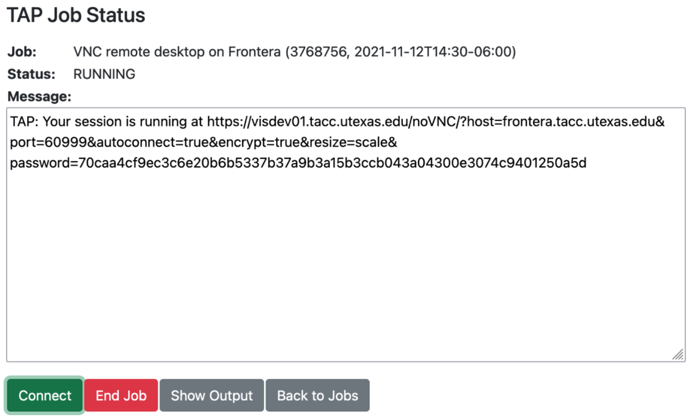

|

.. raw:: html

     Jupyter jobs may take 
    several minutes to start, especially during periods of high workshop usage. You can return 
    to the Job Status page at any time using the <b>Status</b> 
    <b>&nbsp( 3 )&nbsp</b> 
    button from the TAP Home Screen.   

.. raw:: html

    5. Click the <b>Connect</b>
    <b>&nbsp;( 5 )&nbsp;</b>
    
    button from either the Home Screen or Job Status page to connect to your Jupyter Notebook session.
    
      

.. raw:: html

    2. Select the following required inputs:
    <b>&nbsp;( 1 )&nbsp;</b>

Ending a Submitted Job 
^^^^^^^^^^^^^^^^^^^^^^

.. raw:: html

     When you are finished with your session, 
    click the <b>End</b> <b>&nbsp( 4 )&nbsp</b> 
     button on either the TAP Home Screen or 
    the Job Status page. Closing your browser tab does not end the job.    

Resubmitting a Past Job
^^^^^^^^^^^^^^^^^^^^^^^

.. raw:: html

    3. Fill out additional job details:
    <b>&nbsp;( 2 )&nbsp;</b>
     button from the Home Screen. Select 
    <b>Details</b> 
    <b>&nbsp( 6 )&nbsp</b> 
     to review the settings used for a 
    previous job.    

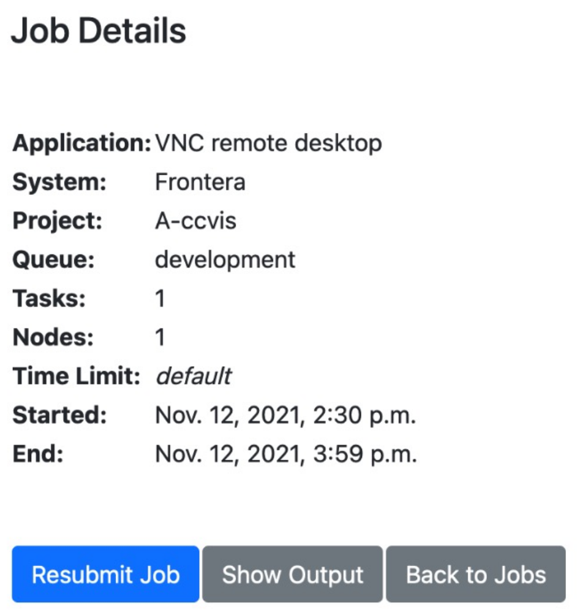

|

Utilities 
--------------------

.. raw:: html

    TAP provides certain useful
    diagnostic and logistic utilities on the Utilities page. Access the Utilities page by selecting
    the <b>Utilities</b>
    <b>&nbsp( 9 )</b> &nbsp;button on the Home Screen page. 
      

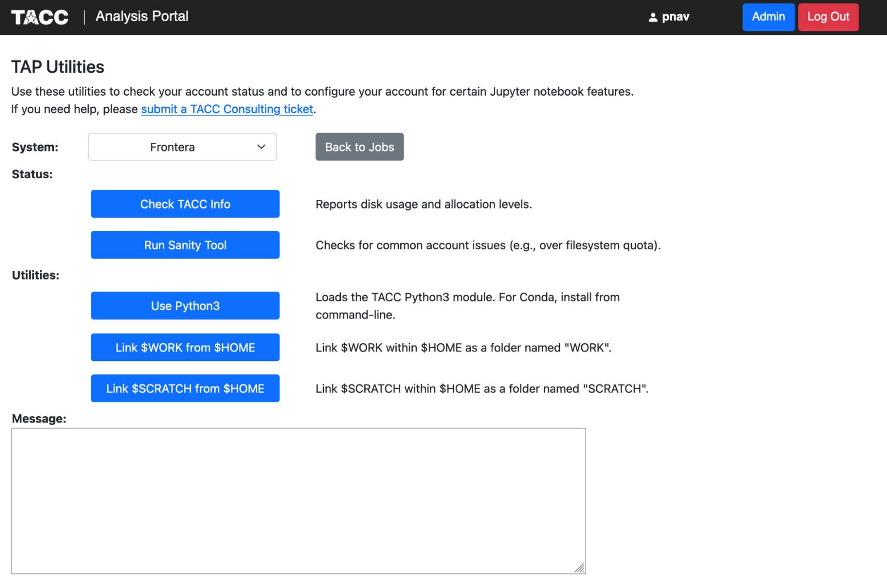

|

Configuring Jupyter Notebooks
^^^^^^^^^^^^^^^^^^^^^^^^^^^^

The Utilities section provides access to several common actions related to Jupyter Notebooks. 

* **"Use Python3"** configures TAP to use the TACC Python3 environment for Jupyter Notebooks. 
  
.. note::

   If you want to use a non-default Python installation, such as Conda, you will need to install 
   it yourself via the system command line. TAP will use the first ``jupyter-notebook`` command 
   in your ``$PATH``, so make sure that the command ``which jupyter-notebook`` returns the 
   Jupyter Notebook you want to use. Conda install typically configures your environment so that 
   Conda is first on your ``$PATH``. 

.. warning::

   Vista by default does not have the Python3 module loaded, nor is it in the default module path.
   This means that if you try to run a Jupyter Notebook on Vista, it will return an error. To fix
   this, you must manually log in to Vista on the command line and perform the following steps:

   .. code-block:: console

      [vista]$ module load gcc
      [vista]$ module load python3
      [vista]$ module save

   This is a one-time setup step. After this, you can use TAP to launch Jupyter Notebooks on Vista.

* **Link $WORK from $HOME"** and **Link $SCRATCH from $HOME** create shortcuts in your 
  ``$HOME`` directory so that you can access those filesystems directly from Jupyter Notebook. 
  The links will appear as ``WORK`` and ``SCRATCH`` in the Jupyter file browser. 

.. note:: 

    TAP launches Jupyter Notebooks from within your ``$HOME`` directory, so these other file 
    systems are not reachable without such a linking mechanism. You only need to create these 
    links once and they will remain available for all future jobs. 

Using Jupyter Notebooks
-----------------------

When you connect to a Jupyter Notebook session, you will first see the Jupyter file browser.

To create a new notebook, click the New button in the top-right corner and select the desired
kernel. The default kernel is Python 3.

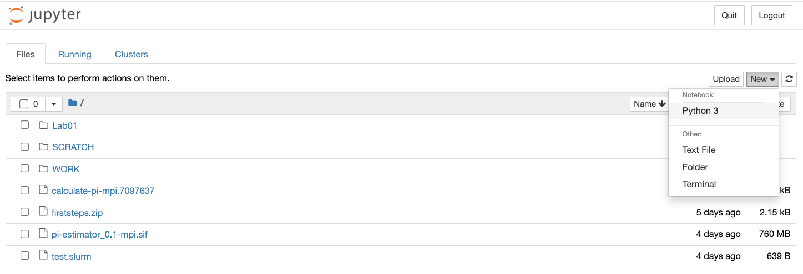

.. note::

    The kernel determines which Python environment and libraries your notebook will use.

    Workshop instructors will configure additional kernels for the workshop and will specify which
    kernel should be used for each activity.

.. raw:: html

     Files created in Jupyter 
    are stored on the TACC filesystem associated with your account and remain available after your 
    notebook session ends.    

Jupyter Notebook User Interface
-------------------------------

The main components of the Jupyter Notebook interface are:

* **Notebook name**: The filename of the notebook (.ipynb). Clicking the name allows you to rename the notebook.
* **Menu bar**: Provides options for creating, saving, and managing notebooks.
* **Toolbar**: Contains shortcuts for common notebook operations such as running cells or inserting new cells.
* **Cells**: The main building blocks of notebooks. Cells can contain either code or formatted text.
* **Output**: Displays the results produced by executed code cells.

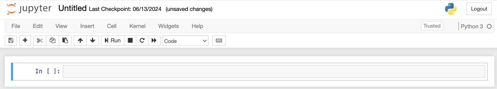

Code Cells
^^^^^^^^^^^^^^

Code cells contain executable Python code. Run a code cell by pressing the **Run** button in the
toolbar or using the keyboard shortcut ``Shift+Enter``.

The output of the code will appear directly below the cell.

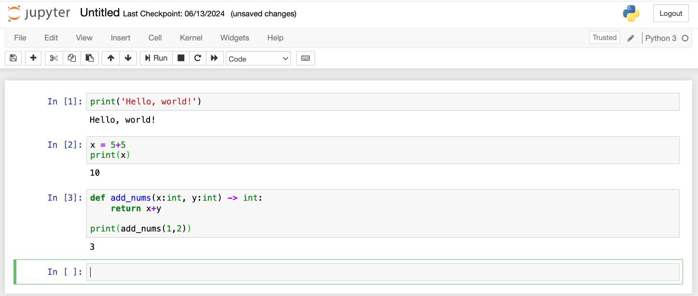

Jupyter Notebooks can import Python libraries, define functions, generate plots, and run arbitrary
Python code. The order in which cells are executed matters. For example, you must first import a
library before using it.

Markdown Cells 
^^^^^^^^^^^^^^

Markdown cells contain formatted text written using Markdown syntax.

Markdown can be used to create headings, lists, links, images, and formatted code blocks. To create
a Markdown cell, change the cell type using the toolbar dropdown menu.

Run the Markdown cell by pressing the **Run** button in the
toolbar or using the keyboard shortcut ``Shift+Enter`` to render the formatted text.

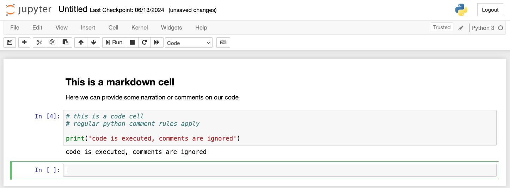

For more information on Markdown formatting, see the
`Markdown guide <https://www.markdownguide.org/cheat-sheet/>`_.

Saving Notebook Files
^^^^^^^^^^^^^^^^^^^^^

Save notebooks by clicking the **Save** button in the toolbar. Notebooks are stored as ``.ipynb``
files.

Saving a notebook preserves:

* Code cells
* Output
* Markdown cells

You can share notebooks with others by sending them the ``.ipynb`` file. To successfully run the
notebook, the recipient must use the same kernel or an environment with the same installed packages.

Jupyter Terminal
----------------

Jupyter also provides a terminal interface for running Linux shell commands directly from your
browser.

To open a terminal, click New and select Terminal.

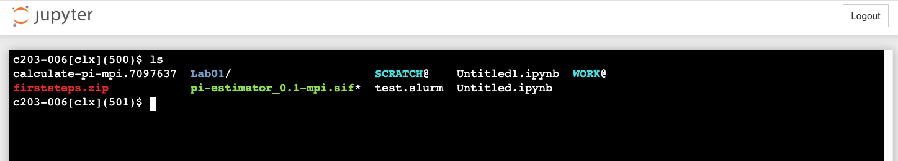

Switching Between Views
-----------------------

By default, Vista launches Jupyter in the Lab view.

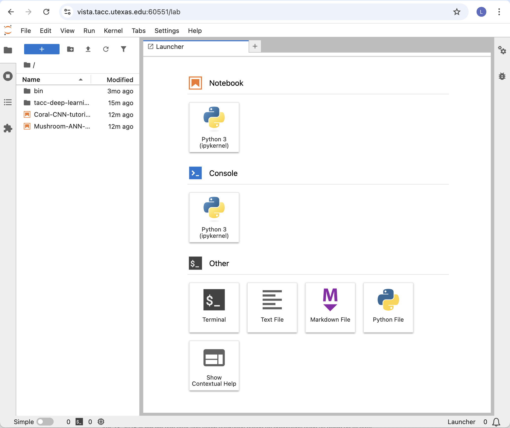

To switch back to the standard file browser view, replace ``/lab`` with ``/tree`` in the notebook URL.

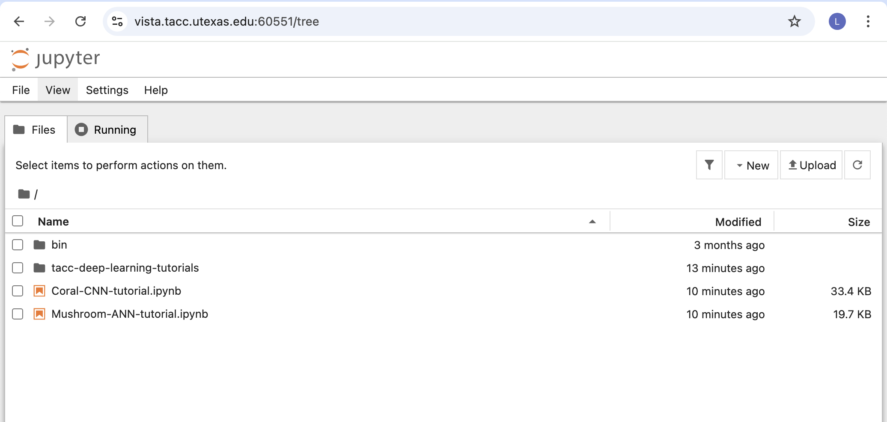

Common Issues
--------------------

* If your notebook will not start, verify that the Python3 module has been configured on Vista. 
* If the **Connect** button does not appear, your job may still be queued or starting.
* If packages are missing, verify that you selected the correct kernel. 
* If you cannot find your files, verify that ``WORK`` or ``SCRATCH`` directories are linked from the 
  Utilities page. 

Additional Resources
--------------------

* `TACC Analysis Portal (TAP) <https://tap.tacc.utexas.edu/>`_
* `TAP documentation <https://docs.tacc.utexas.edu/tutorials/TAP/>`_
* `Jupyter Notebooks <https://jupyter.org/>`_
* `Markdown guide <https://www.markdownguide.org/cheat-sheet/>`_
* `Installing kernels <https://aiml-environments-at-tacc.readthedocs.io/en/latest/ai_containers_tacc/Containerized%20Kernel%20for%20Jupyter%20Notebooks.html>`_